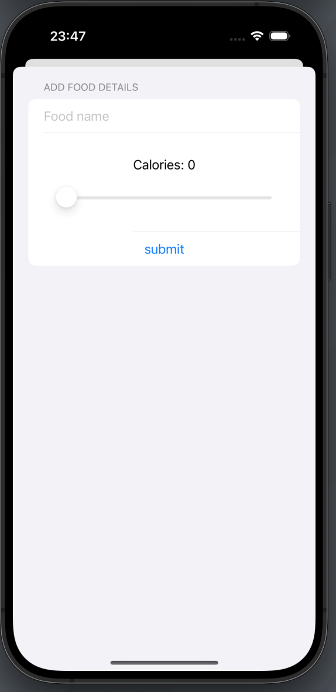
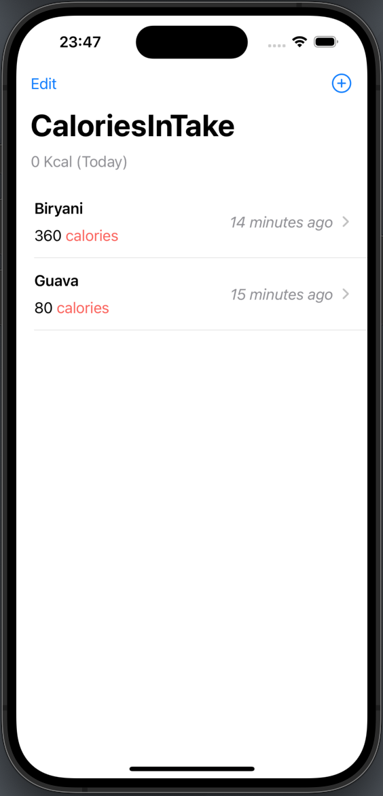
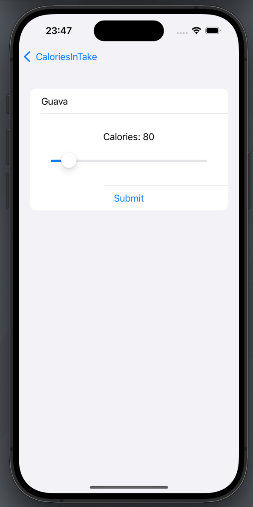
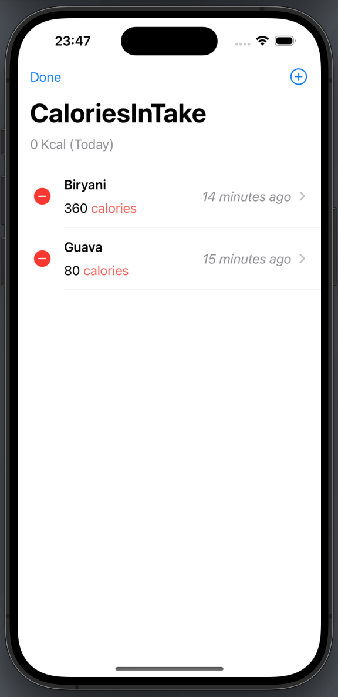
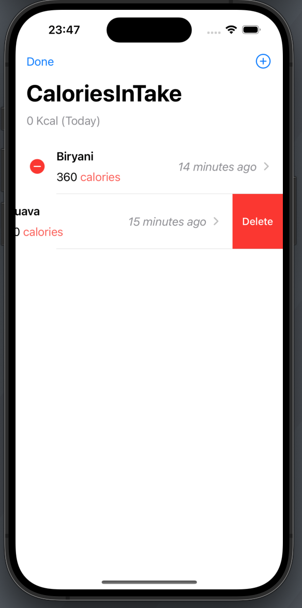

# iOS Calories Intake App

An app designed to help users track their calorie intake by logging food names, calorie counts, and timestamps using Core Data. Developed as a hands-on project to explore and understand the fundamentals of Core Data.
- **Food Input**: Users can enter the name of the food they consume.
- **Calorie Selection**: Users can record calorie counts using an intuitive slider.
- **Timestamp**:  Each entry is automatically timestamped upon submission.
- **Main View**: Displays all logged data in an organized and accessible manner. 
- **Edit View**: Allows users to edit or delete existing entries for better data management.

This app provides a simple and effective way for users to monitor their calorie intake and manage their dietary habits.

## Development

The App is developed using the following technologies:

  - **SwiftUI**:  A declarative framework for building user interfaces across Apple.
  - **Swift**: A modern, intuitive programming language for iOS development.
  - **Xcode**: The integrated development environment (IDE) for building, testing, and running the app.
  - **CoreData**: Apple’s framework for offline data storage and management. 

## Screenshots

    &nbsp;
    &nbsp;
    &nbsp;
    &nbsp;
    &nbsp;

